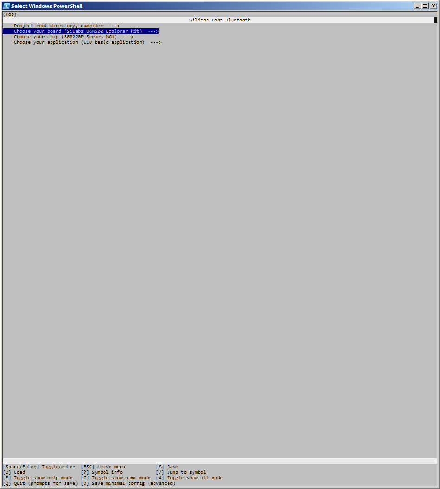

<a href="https://www.bluetooth.com">

  

</a>

<table border="0">
  <tr>
    <td align="left" valign="middle">
    <h1>EFR32 Bluetooth Stack Feature Examples</h1>
  </td>
  <td align="left" valign="middle">
    
  </td>
  </tr>
</table>

# Silicon Labs Bluetooth standalone repository

This repository agregates a collection of bluetooth application examples based on silabs series 2 chip families. xG12 family is supported (along with Thunderboard S2).
It supports both the bluetooth stack from BLE SDKs v2.x as well as v3.x.

TBD : Build and config (Zephyr + Nimble)

</img>

TBD : Bluetooth (HCI + Audio)

TBD : Bluetooth Mesh

Mesh support in in progress and will be illustrated on a EFR32xG21 Wireless Gecko Starter Kit (SoC) and xGM210P Wireless Module Starter Kit (Module). See the link below :
 - https://www.silabs.com/development-tools/wireless/efr32xg21-wireless-starter-kit  
